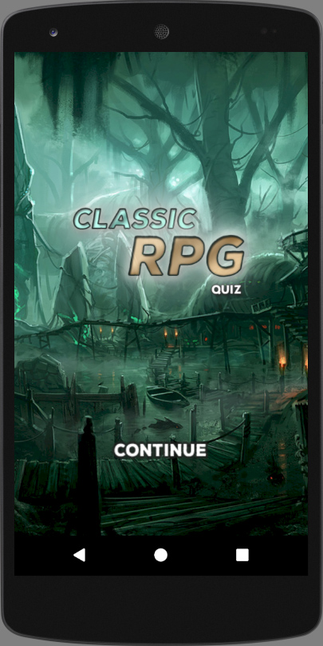
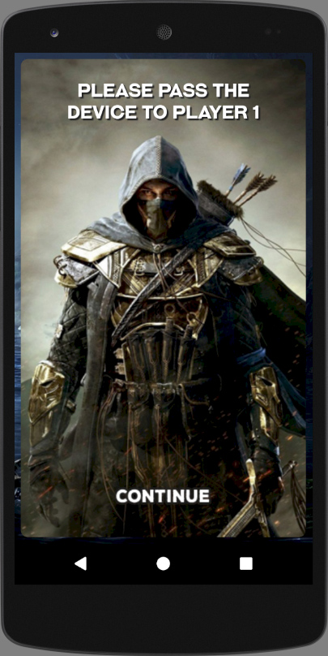
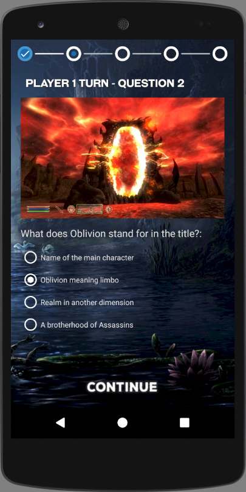
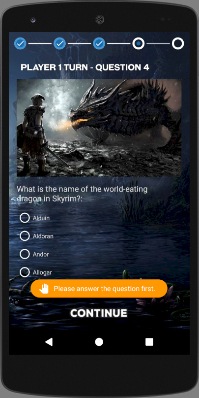
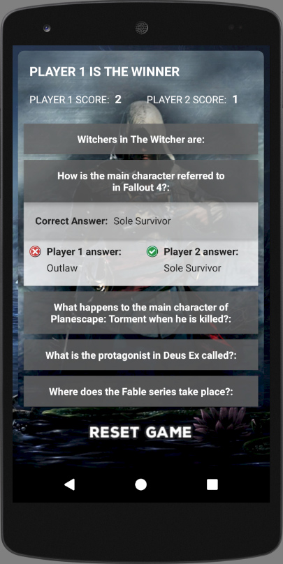

# Quiz App

Project #3 for Google Developer Challenge Scholarship: Android Basics

<h3>Layout</h3>
<table>
  <tr>
    <th>Criteria</th>
    <th>Meets Specifications</th>
  </tr>
  <tbody>
    <tr>
      <td>
        
Overall Layout

      </td>
      <td>
        
App contains 4 - 10 questions, including at least one check box, one radio button, and one text entry.

      </td>
    </tr>
    <tr>
      <td>
        
Question types

      </td>
      <td>
        
Questions are in a variety of formats such as free text response, checkboxes, and radio buttons.

        
Checkboxes are only used for questions with multiple right answers. Radio buttons are only used for questions with a single right answer.

      </td>
    </tr>
    <tr>
      <td>
        
Submit button

      </td>
      <td>
        
App includes a button for the user to submit their answers and receive a score.

      </td>
    </tr>
    <tr>
      <td>
        
Layout best practices

      </td>
      <td>
        
The code adheres to all of the following best practices:

        <ul>
          <li>Text sizes are defined in sp</li>
          <li>Lengths are defined in dp</li>
          <li>Padding and margin is used appropriately, such that the views are not crammed up against each other.</li>
        </ul>
      </td>
    </tr>
    <tr>
      <td>
        
View variety

      </td>
      <td>
        
The app includes at least four of the following Views: TextView, ImageView, Button, Checkbox, EditText, LinearLayout, RelativeLayout, ScrollView, RadioButton, RadioGroup.

        
If applicable, the app uses nested ViewGroups to reduce the complexity of the layout.

      </td>
    </tr>
    <tr>
      <td>
        
Rotation

      </td>
      <td>
        
The app gracefully handles displaying all the content on screen when rotated. Either by updating the layout, adding a scrollable feature or some other mechanism that adheres to Android development guidelines.

      </td>
    </tr>
  </tbody>
</table>

<h3>Functionality</h3>
<table>
  <tr>
    <th>Criteria</th>
    <th>Meets Specifications</th>
  </tr>
  <tbody>
    <tr>
      <td>
        
Runtime Errors

      </td>
      <td>
        
The code runs without errors.

      </td>
    </tr>
    <tr>
      <td>
        
Question Answers

      </td>
      <td>
        
Each question has a correct answer.

      </td>
    </tr>
    <tr>
      <td>
        
Radio Button Implementation

      </td>
      <td>
        
Any question which uses radio buttons allows only one to be checked at once.

      </td>
    </tr>
    <tr>
      <td>
        
Control Statements

      </td>
      <td>
        
The app contains at least one if/else statement

      </td>
    </tr>
    <tr>
      <td>
        
Grading Button Function

      </td>
      <td>
        
The grading button displays a toast which accurately displays the results of the quiz.

      </td>
    </tr>
    <tr>
      <td>
        
Grading Logic

      </td>
      <td>
        
The grading logic checks each answer correctly. The app accurately calculates the number of correct answers and does not include incorrect answers in the count.

        
Note: When applicable, in the grading logic remember to check that the correct answers are checked AND the incorrect answers are not checked.

      </td>
    </tr>
  </tbody>
</table>

<h3>Code Readability</h3>
<table>
  <tr>
    <th>Criteria</th>
    <th>Meets Specifications</th>
  </tr>
  <tbody>
    <tr>
      <td>
        
Naming Conventions

      </td>
      <td>
        
All variables, methods, and resource IDs are descriptively named such that another developer reading the code can easily understand their function.

      </td>
    </tr>
    <tr>
      <td>
        
Format

      </td>
      <td>
        
The code is properly formatted i.e. there are no unnecessary blank lines; there are no unused variables or methods; there is no commented out code. 
        The code also has proper indentation when defining variables and methods.

      </td>
    </tr>
  </tbody>
</table>

<em>Requirements copied from: <a href="http://udacity.com">udacity.com</a>.</em>

 

 
  
  

 
  
  

 
  

